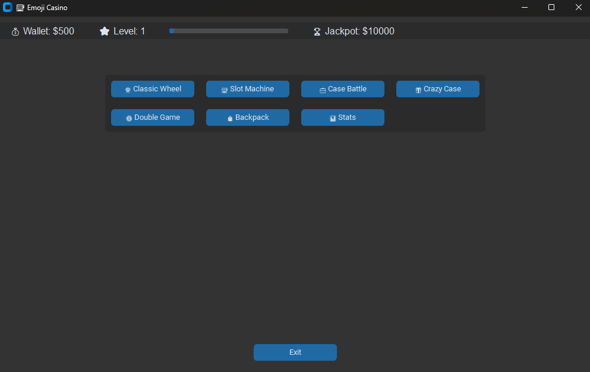
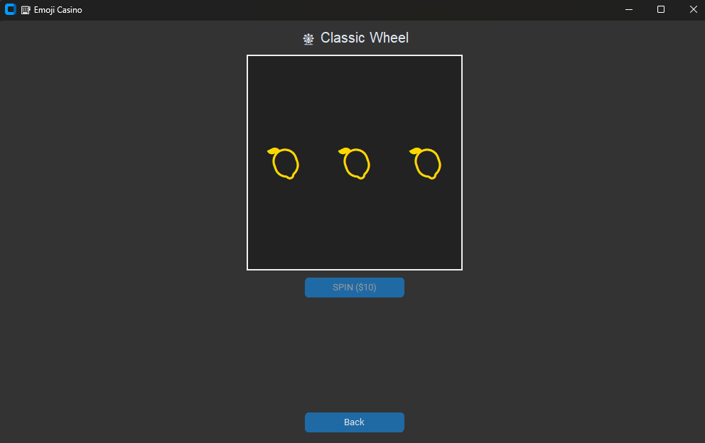
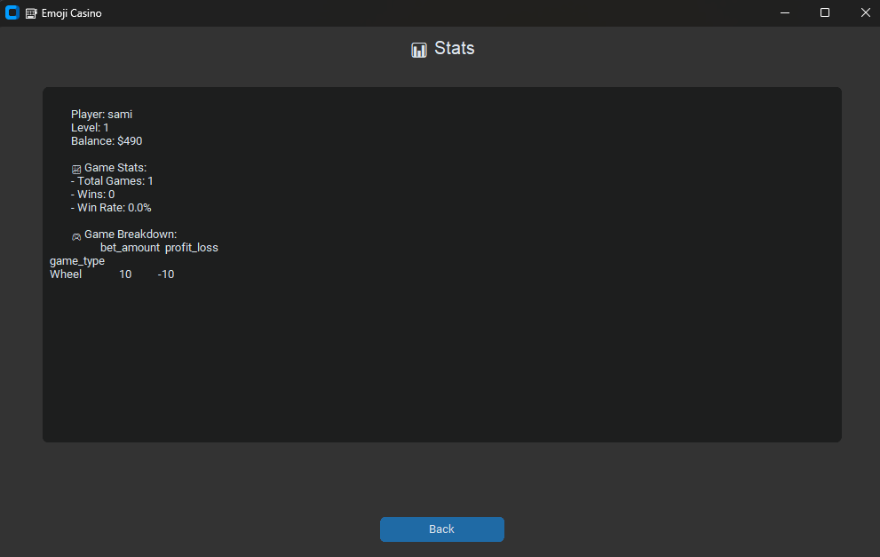

<div align="center">

# 🎰 Emoji Casino ✨
### *High Stakes, High lost*

<br>

> *NOTT modern, graphical casino experience featuring multiple mini-games, a player progression system, and detailed statistics tracking.* 🌸

<br>


</div>

---
<br>

| | | |
|:---:|:---:|:---:|
|  |  |  |

<br>


## 🌟 About The Project
**Emoji Casino** is a desktop application that simulates a casino experience with a fun, emoji based theme but broken animations . 🎀
---

## ✨ Game Modes
*Step right up and test your luck in our 5 signature games!*

| Game | Description |
| :--- | :--- |
| **🎡 Classic Wheel** | Spin the three-reel wheel for big prizes! |
| **🎰 Slot Machine** | The classic casino experience. Match the emojis to win. |
| **💼 Case Battle** | Open mysterious cases to find valuable items... or nothing at all. |
| **🎁 Crazy Case** | A high-risk, high-reward version of Case Battle for the brave. |
| **🪙 Double Game** | A coin flip where the multiplier is fetched in real-time! |

---

## 🌸 Key Features

### 🧍 Player Progression
* **Level Up:** Earn XP by playing games to increase your level.
### 💰 Economy & Inventory
* **Wallet:** Manage your funds across all games.
* **The Backpack:** A dedicated inventory to store and sell the items you win from cases. 🎒

### 📊 Detailed Statistics
* **Track Everything:** All bets, results, and profits are recorded.
* **Data Analysis:** A dedicated stats page provides a summary of your performance, powered by **Pandas**. 📈

---
## 🛠️ Built With
This project relies on these amazing libraries:
* 🐍 **Python 3**
* 🖼️ **CustomTkinter** (Modern UI)
* 🐼 **Pandas** (Data & Stats)
* 🌐 **Requests** (Real-time data fetching)
---

## 🚀 Getting Started
Ready to play? Follow these simple steps to get the casino running on your machine.
### 🧩 Prerequisites
Make sure you have **Python 3** installed.

### 📦 Installation
**1. Clone the repository:**
```bash
git clone [https://github.com/CipherS88/emoji-casino.git](https://github.com/CipherS88/emoji-casino.git)
```
**2. Navigate to the folder:**
```bash
cd emoji-casino
```
**3. Install requirements: Note: You only need to install the external libraries. Modules like random, time, and threading are built-in!**
```bash
pip install customtkinter pandas requests
```
**4. Run the Casino:**
```bash
python 2x.py
```
